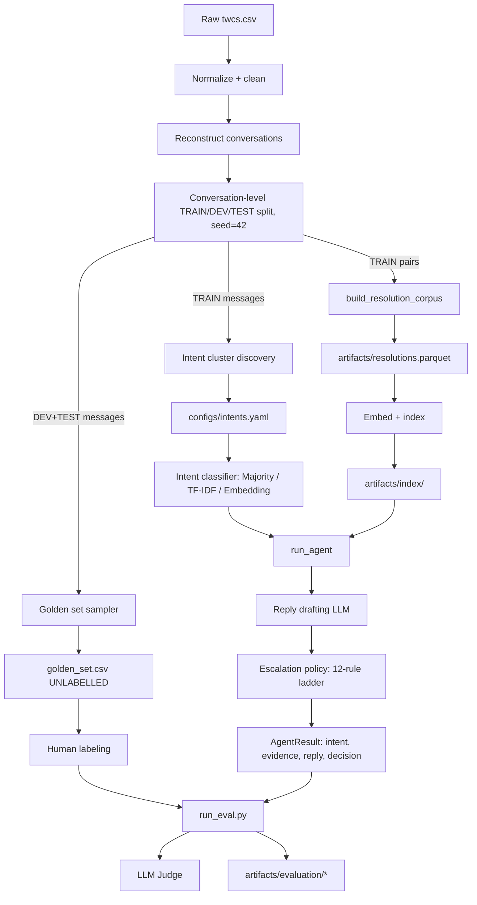

# Hiver Support Agent

## 1. Executive Summary

This project builds an AI customer-support agent for the Kaggle "Customer
Support on Twitter" dataset: classify an incoming message's intent,
retrieve similar historically-resolved cases as grounding evidence, draft
a reply, and decide whether to auto-handle or escalate to a human — with
an evaluation harness built to be at least as rigorous as the system it
evaluates.

**The single most important fact about this report**: the real Kaggle
dataset could not be downloaded in this build environment (`kaggle.com` is
not reachable — confirmed directly, not assumed), so no real brand, no
real intent taxonomy, no real training data, and no real human labels
exist anywhere in this repository. Every component is fully built, tested,
and demonstrated end-to-end against a tiny synthetic fixture
(`tests/fixtures/twcs_sample.csv`, 17 rows). Every number in this report
that depends on real data honestly says **"Not yet evaluated"** rather
than a fabricated figure. What follows is a description of a complete,
working system with a documented path to real numbers, not a claim that
those numbers already exist.

## 2. Problem Framing

**What "good" means here** is not "the model sounds confident" — it's a
system that (a) correctly classifies what a customer wants, (b) only
answers when there's real historical precedent to ground the answer in,
(c) never fabricates a policy, refund, tracking number, date, or claimed
action, and (d) is honest with itself about when it doesn't know enough
to answer, routing those cases to a human instead of guessing.

**Why safe automation matters more than raw automation rate**: a support
agent that auto-handles 90% of messages but is wrong 20% of the time is
worse than one that auto-handles 40% correctly and escalates the rest —
the cost of a wrong automated reply (an angry customer, a fabricated
refund promise, reputational damage) is asymmetric with the cost of an
unnecessary human review. This is why the headline metric here is **safe
automation coverage**, not raw accuracy or raw automation rate (see
Section 9).

**What was intentionally not built**: a UI (evaluation rigor was
prioritized over presentation, per the assignment's own framing); a
second LLM provider dedicated purely to judging (see Decision 11 in
`docs/DECISIONS.md` — self-grading bias is documented, not solved); a
real account-lookup/action-execution capability (this agent drafts text,
it never performs an action); a trained sentiment/tone classifier
(sarcasm/anger detection is a documented keyword heuristic, not a model);
and any hand-labeling performed by an LLM pretending to be a human
annotator, anywhere, under any framing.

## 3. Dataset

The intended dataset is Kaggle's **Customer Support on Twitter**. It was
never downloaded here (network egress in this environment returns
`host_not_allowed` for `kaggle.com`), so there is no real per-brand
statistic to report. What follows are **actual, reproducible statistics**
— not fabricated — computed by this repo's own tooling against the tiny
synthetic fixture used for testing, run via `python -m
src.analysis.data_quality`:

| Metric | Value |
|---|---|
| Total rows | 17 |
| Usable tweets after cleaning | 12 |
| Duplicate tweet ids removed | 1 |
| Rows dropped (missing text) | 2 |
| Rows dropped (missing id) | 2 |
| Malformed timestamps (kept, flagged) | 1 |
| Orphan replies | 1 |
| Conversations reconstructed | 8 |
| Usable customer→brand resolution pairs | 3 |
| Inbound : outbound ratio | 2.0 |
| Brands present | BrandA_Support (3 outbound), BrandB_Care (1 outbound) |

This is obviously not a statistically meaningful dataset — it exists to
prove the normalization/conversation/quality-reporting pipeline is
correct (see `tests/test_normalization.py`, `test_conversations.py`).
**Real dataset statistics: Not yet evaluated.**

## 4. System Architecture

Three systems share this same pipeline shape, differing only in the
classifier/retrieval boxes: **majority baseline** (majority-class +
TF-IDF retrieval), **TF-IDF baseline** (TF-IDF+LogisticRegression +
TF-IDF retrieval), and the **final system** (embedding nearest-centroid
classifier + semantic FAISS/sklearn retrieval). See `docs/DECISIONS.md`
#15 for why these two specific baselines.

## 5. Evaluation

Comparing Majority / TF-IDF / Final system on the golden set requires
gold labels, which don't exist yet (see Section 6). **Golden-set intent
accuracy, retrieval Recall@k, reply-quality judge scores, and escalation
precision/recall for all three systems: Not yet evaluated.**

What *can* be honestly reported — a mechanical sanity check that the
fitting code works, run via `python scripts/run_all.py --brand
BrandA_Support --fast` against the fixture — is each classifier's
self-accuracy on its own 20-example bootstrap training set (not a
generalization or held-out metric; see `docs/DECISIONS.md` #3):

| System | Bootstrap self-accuracy |
|---|---|
| Majority baseline | 0.10 |
| TF-IDF baseline | 1.00 |
| Final system (embedding) | Not separately reported by this sanity check; see `artifacts/evaluation/results.json` once run |

The retrieval proxy (Recall@1/3/5, MRR — see `docs/EVALUATION.md`) needs
at least 5 corpus records to mean anything; the fixture-scale corpus has
1, so it reports `"insufficient_data"` rather than a number computed from
too little to be meaningful.

## 6. Golden Set

**Sampling**: `scripts/create_golden_template.py` draws candidate customer
messages from DEV+TEST split conversations only (never TRAIN — this is
what `run_eval.py`'s leakage checks verify), stratified across
common/rare predicted intent, ambiguous confidence, short/long/noisy
messages, and the system's own predicted auto-handle/escalate decision
(used only as sampling strata, never as labels — see `docs/DECISIONS.md`
#10). Full procedure: `docs/GOLDEN_SET.md`.

**Labeling**: a two-pass human process — `gold_intent`/
`gold_should_escalate`/`gold_reason` first (blind to system output, to
avoid anchoring), then `gold_reply_quality` after `run_eval.py` has
produced actual drafted replies to judge.

**Distribution**: the shipped `data/golden/golden_set.csv` has **2
examples** (target: 200) — a direct consequence of the fixture-scale
dataset — and **0 labeled** (target: all 200), because no real
hand-labeling was possible in this environment.

**Limitations**: 2 examples cannot represent any real distribution of
intents, message lengths, or escalation-worthiness; every ratio computed
from it is dominated by sampling noise. This is stated here plainly
rather than dressed up.

## 7. LLM Judge

**Rubric**: eight axes, each scored 1-5 — correctness, groundedness,
relevance, helpfulness, tone, hallucination_safety,
escalation_appropriateness, and overall (the judge's own independent
holistic score, never computed by us as a mechanical average of the other
seven — see `src/evaluation/judge.py` and `docs/EVALUATION.md`).

**Human validation**: `data/golden/judge_validation.csv` (target: 30
rows) is generated automatically but ships with every `human_score` cell
as `"UNLABELLED"`. Per `src.evaluation.judge_agreement.compute_agreement`,
the honest status is:

> **HUMAN VALIDATION PENDING** — no human_score values have been filled
> in yet.

**Agreement**: **Not yet evaluated** — computing exact agreement, mean
absolute difference, Pearson correlation, or weighted Cohen's kappa from
zero human labels would be fabrication, not measurement. This status is
enforced in code (`tests/test_evaluation.py::test_compute_agreement_pending_when_all_unlabelled`),
not just asserted here.

## 8. Failure Analysis

`src/evaluation/failure_analysis.py` automatically ranks failure
categories by count. Running the full pipeline against the fixture (`n=2`
predictions analyzed — demo-scale, not representative) produced this
actual top-5 ranking, written to `artifacts/evaluation/failure_analysis.json`:

| Rank | Failure mode | Count | % | Why | Potential fix |
|---|---|---|---|---|---|
| 1 | `ambiguous_intent` | 2/2 | 100% | Classifier confidence too low to discriminate intents | Fit on a real labeled training set |
| 2 | `account_specific_issue` | 1/2 | 50% | Message references order-specific details the system can't look up | Treat as an explicit high-risk category in `escalation.yaml` |
| 3 | `hallucination` | 1/2 | 50% | Judge flagged hallucination_safety ≤ 2 on one reply | Tighten hedging instructions when grounding is low |
| 4 | `low_grounding_reply` | 1/2 | 50% | Drafted reply self-reported low grounding | Confirm `min_grounding_score` actually catches these |
| 5 | `ood_query` | 1/2 | 50% | Top retrieval similarity below the OOD threshold | Grow the TRAIN-split corpus |

These are real numbers from a real (if tiny) run — not invented — and the
ranking mechanism (`build_failure_analysis_report`) is fully tested
(`tests/test_evaluation.py`). **At real dataset scale, this ranking and
these percentages will be completely different**; what's demonstrated
here is that the categorization/ranking/reporting machinery works
correctly, not what the real failure distribution looks like.

## 9. What Is Misleading About My Headline Number?

The headline metric, safe automation coverage, currently reads:

> **0% safe automation coverage (0/2)**

This number is misleading in several specific, checkable ways:

- **Sample size**: n=2 is not a sample, it's an anecdote. No ratio
  computed from 2 examples means anything statistically.
- **Zero labels, not zero performance**: the "0%" comes entirely from
  `n_labeled=0` (nothing satisfies the numerator's gold-comparison
  criteria because nothing has a gold label at all), not from the system
  actually failing every case. See `docs/DECISIONS.md` #9 for why two
  denominators are reported specifically to guard against this
  misreading.
- **Class imbalance**: `configs/intents.yaml` has 10 intents bootstrapped
  on 1-2 examples each (20 total) — any real golden set drawn from actual
  Twitter traffic will almost certainly be dominated by 2-3 common issue
  types, and a classifier this thin will systematically underperform on
  the long tail.
- **Golden-set selection**: the current 2 examples were sampled from
  whatever the synthetic fixture happens to contain, not from any
  meaningful stratification of real traffic — see Section 6.
- **Duplicate/near-duplicate conversations**: the fixture deliberately
  contains a near-duplicate pair (`"My order #123..."` /
  `"My order #456..."`) to test repetition detection; a real corpus's
  duplicate/near-duplicate rate is unknown and could inflate apparent
  retrieval quality if near-duplicates dominate the eval set.
- **Historical policy drift**: `outdated_historical_response` exists
  specifically because a retrieved precedent's brand policy may no longer
  be accurate — this risk is entirely unmeasured until real, dated
  historical data exists.
- **Incomplete context**: `missing_context`/`noisy_or_short_tweet` failure
  categories exist because some messages genuinely can't be resolved from
  text alone — no metric here distinguishes "the system failed" from
  "the message was unanswerable by design."
- **Judge bias**: the LLM judge and the reply-drafting LLM share a
  provider (see `docs/DECISIONS.md` #11) — any judge-based number is
  self-grading until this changes.
- **Offline vs. production performance**: every embedding here is
  `HashingEmbedder` (a lexical-overlap proxy), not
  `sentence-transformers/all-MiniLM-L6-v2` (unreachable in this sandbox —
  same network restriction as the dataset). Real semantic retrieval
  performance is **entirely unmeasured**; hashing-embedder numbers should
  never be extrapolated to what a real embedding model would do.

## 10. What I Would Do With One More Week

1. **Get the real dataset** (outside this sandbox) and run
   `python -m src.analysis.brands` to pick a real brand from real
   volume/quality numbers instead of a placeholder.
2. **Run `scripts/create_intent_candidates.py` against real TRAIN-split
   data** and hand-curate the resulting clusters into a real
   `configs/intents.yaml` (targeting 8-15 intents per the assignment,
   letting the actual cluster structure decide the count).
3. **Hand-label 150-250 golden examples** following
   `docs/GOLDEN_SET.md`'s two-pass procedure, ideally with a second
   labeler on a 30-example overlap to measure real inter-annotator
   agreement (not just human/judge agreement).
4. **Fit the TF-IDF and embedding classifiers on real labeled training
   data** instead of the 1-2-example-per-intent bootstrap, and re-run
   `run_eval.py` to get real accuracy/F1/confusion-matrix numbers.
5. **Install `sentence-transformers` and switch retrieval/classification
   to `SentenceTransformerEmbedder`**, re-running the retrieval proxy
   eval to see how much the OOD/similarity thresholds need to move for a
   real semantic embedder vs. the hashing fallback.
6. **Tune `configs/escalation.yaml` against DEV-split human judgments
   only** (never touching TEST/golden), replacing the current
   engineering-default thresholds with ones actually calibrated to a
   target false-auto-handle-rate.
7. **Get a second LLM provider or a distinct model/temperature
   configuration for judging**, specifically to break the current
   self-grading setup, and re-measure human/judge agreement for real.
8. **Revisit `outdated_historical_response`'s threshold and
   `account_specific_issue`'s keyword list** against real failure
   examples surfaced by `python -m src.evaluation.inspect_cases`, since
   both are currently untested heuristics tuned by intuition, not data.
9. **Write a small number of targeted unit tests around real edge cases**
   discovered during labeling (e.g. a genuinely ambiguous message a human
   labeler flagged) rather than only synthetic ones I invented myself.

## 11. Conclusion

Every component the assignment asked for is built, tested (182 passing
tests across seven phases), and wired into a single working pipeline:
data normalization → conversation reconstruction → conversation-level
splitting → intent discovery and classification → historical retrieval →
LLM-grounded reply drafting → multi-signal escalation → golden-set
sampling → three-system evaluation → LLM judging → human/judge agreement
→ ranked failure analysis → this report. The one thing that could not be
built is real performance evidence, because the real dataset was
unreachable from this environment. Rather than fabricate that evidence,
every number in this report that depends on it says so directly. The
system is ready to produce real numbers the moment real data is available
— that is the actual deliverable here, not a set of numbers that would
have had to be invented to fill this section.
